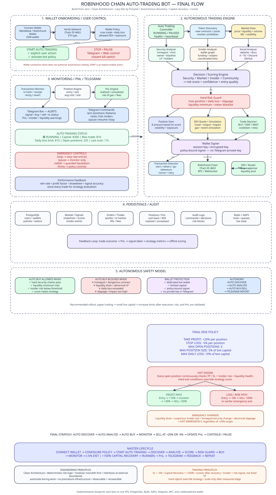

# Robinhood Chain Autonomous Trading Bot

> An open-source, self-hosted Web3 trading bot for Robinhood Chain focused on automated token discovery, security analysis, market intelligence, wallet/insider analysis, risk-controlled execution, capital recovery, and Telegram-based operations.

[](#project-status)
[](https://docs.robinhood.com/chain/)
[](https://go.dev/)

## ⚠️ Disclaimer

This project is experimental software for educational and research purposes.

It is **not financial advice** and it does not guarantee profit. Automated crypto trading can lose some or all trading capital. Smart-contract, liquidity, RPC, wallet, execution, market-data, and infrastructure risks may result in unexpected losses.

Never deploy a new strategy directly with meaningful capital. Start with testnet and paper trading, then use a small amount of capital that you can afford to lose.

---

## Overview

The bot is designed to operate autonomously:

```text
/start
   ↓
Connect / authorize wallet
   ↓
Verify Robinhood Chain
   ↓
Configure risk policy
   ↓
START AUTO TRADING
   ↓
Automatic token discovery
   ↓
Security analysis
   ↓
Market / liquidity analysis
   ↓
Insider / wallet graph analysis
   ↓
Website / community analysis
   ↓
Opportunity scoring
   ↓
Risk Guard
   ├── SKIP
   └── BUY
          ↓
       Monitor
       ├── -5%  → STOP LOSS
       ├── +100% → CAPITAL RECOVERY
       │              ↓
       │           RUNNER
       └── emergency risk → EXIT
          ↓
       PnL / accounting
          ↓
       Telegram
          ↓
       feedback loop
```

The system is designed so that **Telegram is the control and alerting plane, while the actual financial rules are enforced by the backend risk engine**.

---

## Core Trading Policy

### Stop Loss

```text
-5% from entry
```

### Capital Recovery

```text
+100% from entry

Example:

Initial position: $10
Position reaches approximately: $20

Sell enough to recover the original $10 capital
after accounting for execution costs where applicable.

Remaining position becomes the runner.
```

### Runner

After capital recovery, the residual position may continue to run.

The runner can exit due to:

- trailing/risk logic,
- liquidity deterioration,
- severe insider dumping,
- contract/security anomalies,
- strategy invalidation,
- emergency risk conditions.

There is **no hard +20% take-profit** in the current strategy.

### Insider Analysis

Insider analysis is primarily a **risk intelligence signal**, not a fixed profit-taking trigger.

Normal accumulation does not automatically close a winning trade.

Strong coordinated selling, deployer exits, liquidity drains, or other severe anomalies can override the strategy and trigger an emergency exit.

---

## Architecture



The architecture is based on Clean Architecture and a modular-monolith-first approach.

```text
Interface Adapters
    ├── Telegram Bot
    ├── Telegram Mini App
    ├── HTTP API
    └── CLI / operational tools
             ↓
Application / Use Cases
    ├── Discover Tokens
    ├── Analyze Token
    ├── Rank Opportunities
    ├── Evaluate Risk
    ├── Execute Trade
    ├── Recover Capital
    ├── Manage Runner
    └── Calculate PnL
             ↓
Domain
    ├── Token
    ├── MarketSnapshot
    ├── WalletGraph
    ├── Signal
    ├── RiskScore
    ├── Order
    ├── Trade
    ├── Position
    ├── TradingPolicy
    └── PnL
             ↑
Infrastructure
    ├── Robinhood Chain RPC/WebSocket
    ├── DEX adapters
    ├── PostgreSQL
    ├── Redis
    ├── NATS JetStream
    ├── Telegram API
    └── External market/security providers
```

### Important design rule

Financial business logic must not depend directly on Telegram SDKs, database drivers, RPC providers, HTTP frameworks, or vendor APIs. External systems are adapters.

---

## Auto-Trading Lifecycle

```text
WALLET AUTHORIZATION
        ↓
NETWORK VERIFICATION
        ↓
RISK POLICY
        ↓
START AUTO TRADING
        ↓
TOKEN DISCOVERY
        ↓
CANDIDATE FILTER
        ↓
SECURITY ANALYSIS
        ↓
MARKET ANALYSIS
        ↓
INSIDER ANALYSIS
        ↓
SOCIAL / PROJECT ANALYSIS
        ↓
SCORING
        ↓
RISK GUARD
        ↓
QUOTE + SIMULATION
        ↓
SIGN
        ↓
BROADCAST
        ↓
MONITOR FILL
        ↓
POSITION
        ↓
      ┌───────────────┐
      │               │
    -5%             +100%
      │               │
      ↓               ↓
   STOP LOSS    CAPITAL RECOVERY
                      ↓
                   RUNNER
                      ↓
                TRAILING / EXIT
                      ↓
                    PnL
                      ↓
                 TELEGRAM
```

---

## Automatic Token Discovery

The bot is not limited to:

```text
/scan 0xTOKEN
```

It can continuously discover candidates from on-chain and market-data sources such as:

- new contracts,
- new DEX pools,
- liquidity events,
- swap activity,
- indexed token/market sources,
- configurable third-party data providers.

A discovered token is only a **candidate**. It must pass the filtering and analysis pipeline before it becomes tradable.

---

## Token Security Analysis

The security layer can evaluate:

- contract verification,
- proxy/implementation structure,
- owner/admin privileges,
- minting capability,
- pause/freeze capability,
- blacklist/whitelist behavior,
- transfer restrictions,
- buy/sell taxes where observable,
- fee mutation permissions,
- trading controls,
- suspicious contract behavior,
- LP ownership/locking information,
- holder concentration,
- deployer behavior.

A hard security failure must override a high opportunity score.

```text
honeypot suspected
    ↓
REJECT
```

---

## Market Intelligence

The market engine evaluates more than market cap.

Important features include:

```text
market cap
liquidity
volume
volatility
price impact
liquidity / market-cap ratio
holder distribution
pool age
trading frequency
buy/sell pressure
```

A token with:

```text
high market cap
+
tiny liquidity
+
suspicious volume
```

should not be treated as healthy just because the market cap is large.

---

## Insider / Wallet Intelligence

The bot maintains a graph of relevant wallet activity.

Potential relationships include:

```text
Deployer
   ├── funding source
   ├── early buyer A
   ├── early buyer B
   ├── whale
   └── coordinated wallet cluster
```

The system can look for:

- common funding sources,
- early-buyer clusters,
- coordinated entries,
- coordinated exits,
- deployer activity,
- whale accumulation,
- suspicious transfers,
- liquidity-provider actions.

Signals should explain **why** a risk score changed instead of returning only a number.

---

## Website / Community Intelligence

Where data is available, the bot can evaluate:

- website,
- documentation,
- GitHub,
- X,
- Telegram,
- Discord,
- project metadata,
- contract address consistency,
- development activity,
- suspicious or inconsistent project information.

Community data is treated as a **confidence signal**, not proof of legitimacy.

---

## Telegram Control Plane

Core commands:

```text
/start
/connect

/status
/start_auto
/stop_auto
/pause
/resume

/scan <token>
/details <token>
/watch <token>

/balance
/positions
/orders
/pnl
/stats
/risk
/limits
/health

/sellall
```

Dangerous commands should require explicit confirmation and server-side authorization.

---

## Telegram Mini App

The Mini App is used for interactive flows such as:

- wallet authorization,
- network verification,
- risk-policy configuration,
- trading status,
- compact portfolio view,
- start/stop controls.

Telegram Mini Apps can run directly inside Telegram and can replace a standalone website for many app flows. The Mini App must send `initData` to the backend for validation; `initDataUnsafe` must not be trusted directly.

---

## Wallet & Security Model

Never expose a user's main-wallet private key to Telegram.

Preferred:

```text
OWNER / MAIN WALLET
        ↓
fund / authorize
        ↓
DEDICATED BOT WALLET
        ↓
policy-bound signer
        ↓
Robinhood Chain
```

The bot wallet should hold only the capital intended for automated trading.

Recommended controls:

```text
max position size
max open positions
daily loss limit
allowed contracts / routers
slippage limit
liquidity minimum
emergency pause
```

Future hardening can evaluate programmable wallets, ERC-4337, session keys, spending controls, and gas sponsorship.

---

## Robinhood Chain

Current mainnet baseline:

| Property | Value |
|---|---|
| Network | Robinhood Chain |
| Type | Arbitrum Layer-2 |
| Chain ID | `4663` |
| Testnet Chain ID | `46630` |
| Gas Token | ETH |
| Explorer | `https://robinhoodchain.blockscout.com` |

Robinhood Chain is EVM-compatible and supports standard Ethereum tooling. Official documentation currently recommends Alchemy for production RPC access; public RPC endpoints are rate-limited and are not recommended for production workloads.

Always re-check official documentation before relying on network endpoints, contract addresses, service availability, or provider limits.

---

## Tech Stack

### Backend

- Go
- Clean Architecture
- PostgreSQL 17
- Redis
- NATS JetStream
- `go-ethereum`

### Web3

- EVM JSON-RPC
- WebSocket
- ABI bindings
- DEX adapters
- transaction simulation
- wallet/signer abstraction

### Telegram

- Telegram Bot API
- Telegram Mini App

### Infrastructure

- Docker
- Docker Compose
- VPS
- GitHub Actions

### Observability

- structured logs
- health checks
- metrics
- Telegram alerts

Optional later:

- Prometheus
- Grafana
- OpenTelemetry
- Loki

---

## Repository Structure

```text
.
├── cmd/
│   ├── api/
│   ├── bot/
│   ├── scanner/
│   └── worker/
│
├── internal/
│   ├── domain/
│   ├── application/
│   ├── chain/
│   ├── discovery/
│   ├── token/
│   ├── security/
│   ├── market/
│   ├── insider/
│   ├── social/
│   ├── scoring/
│   ├── strategy/
│   ├── risk/
│   ├── wallet/
│   ├── execution/
│   ├── position/
│   ├── pnl/
│   ├── telegram/
│   ├── persistence/
│   └── observability/
│
├── migrations/
├── contracts/
├── deployments/
├── docs/
│   ├── architecture.excalidraw
│   └── architecture.svg
├── tests/
├── CLAUDE.md
├── docker-compose.yml
├── Makefile
└── README.md
```

---

## Development Philosophy — Lazy Dev by Ponytail

> Build less, reuse more, automate repetitive work, and make the boring path reliable.

That means:

- modular monolith first,
- no unnecessary microservices,
- no Kubernetes until needed,
- prefer proven libraries,
- automate tests and deployment,
- keep interfaces narrow,
- use configuration instead of magic numbers,
- avoid speculative abstractions,
- optimize for maintainability.

“Lazy” means reducing unnecessary work — **not reducing engineering quality**.

---

## Safety Philosophy

The strategy engine may propose a trade, but the risk engine has final authority.

```text
Strategy says BUY
       ↓
Risk Guard
       ├── REJECT
       └── ALLOW
              ↓
        Simulation
              ↓
            Sign
```

Hard risk controls must never be bypassed by Telegram commands, AI output, scoring models, or third-party market signals.

---

## PnL Accounting

Track separately:

```text
Realized PnL
Unrealized PnL
Gross PnL
Net PnL
ROI
Drawdown
```

Net PnL should account for:

```text
gross PnL
- gas
- DEX fees
- slippage
= net PnL
```

The system must never report an unrealized price increase as realized cash profit.

---

## Paper Trading First

Before using real funds, the bot should support paper trading with the same:

- discovery,
- analysis,
- scoring,
- risk engine,
- strategy,
- position logic,
- capital recovery logic,
- PnL accounting.

Only signing/broadcasting is replaced by simulated execution.

Recommended rollout:

```text
1. Unit tests
2. Integration tests
3. Testnet
4. Paper trading
5. Small live capital
6. Measure 100–300+ trades
7. Improve strategy
8. Scale only if the measured edge survives costs and drawdown
```

---

## Performance Metrics

Track:

```text
Win rate
Average win
Average loss
Expectancy / trade
Profit factor
Net PnL
ROI
Maximum drawdown
Trade count
Gas cost
Fee cost
Slippage
Capital recovery rate
Runner contribution
Signal accuracy
```

A strategy that earns more while taking disproportionate tail risk is not automatically an improvement.

---

## Configuration

Create `.env.example` and never commit production secrets.

```env
APP_ENV=development

RH_CHAIN_ID=4663
RH_RPC_URL=
RH_WS_URL=

POSTGRES_URL=
REDIS_URL=
NATS_URL=

TELEGRAM_BOT_TOKEN=
TELEGRAM_ALLOWED_USER_IDS=

BOT_WALLET_ADDRESS=
BOT_WALLET_SIGNER_REF=

STOP_LOSS_PERCENT=5
CAPITAL_RECOVERY_PERCENT=100

MAX_POSITION_PERCENT=5
MAX_OPEN_POSITIONS=5
DAILY_LOSS_LIMIT_PERCENT=10

MAX_SLIPPAGE_BPS=
MIN_LIQUIDITY_USD=
MIN_SCORE=
```

---

## Local Development

### Prerequisites

- Go
- Docker
- Docker Compose
- Git
- Telegram account
- Telegram bot created through BotFather
- EVM wallet for testnet/development
- RPC access

### Start dependencies

```bash
docker compose up -d
```

### Create environment

```bash
cp .env.example .env
```

### Run tests

```bash
go test ./...
```

### Run bot

```bash
go run ./cmd/bot
```

### Run scanner

```bash
go run ./cmd/scanner
```

Exact commands may evolve with the implementation.

---

## Security Checklist

- [ ] Dedicated bot wallet
- [ ] Main wallet private key is not stored by the bot
- [ ] Telegram user IDs are allowlisted
- [ ] Telegram bot token is stored as a secret
- [ ] Mini App `initData` is validated server-side
- [ ] Command replay protection
- [ ] Dangerous commands require confirmation
- [ ] Deterministic risk engine
- [ ] Position limits enforced server-side
- [ ] Daily loss limit enforced
- [ ] Transaction simulation
- [ ] Duplicate-order prevention
- [ ] Pending transactions reconciled after restart
- [ ] PnL accounting tested
- [ ] Paper trading exercised
- [ ] Kill switch tested
- [ ] VPS backups configured
- [ ] Logs contain no secrets

---

## Project Status

**Experimental / Early Development**

The architecture and specification are intentionally ahead of the implementation.

Expect:

- incomplete modules,
- changing APIs,
- strategy iteration,
- temporary adapters,
- limited test coverage during early development.

This repository should not be treated as production-safe until security, execution, accounting, and recovery tests have been completed.

---

## Roadmap

### Phase 0 — Foundation

- [ ] Go module
- [ ] Clean Architecture skeleton
- [ ] Docker Compose
- [ ] PostgreSQL
- [ ] Redis
- [ ] NATS
- [ ] CI
- [ ] logging / health

### Phase 1 — Chain

- [ ] Robinhood Chain RPC
- [ ] WebSocket
- [ ] block listener
- [ ] balance reads
- [ ] transaction reads

### Phase 2 — Telegram

- [ ] `/start`
- [ ] authentication
- [ ] command router
- [ ] alerts

### Phase 3 — Wallet

- [ ] Mini App
- [ ] wallet authorization
- [ ] chain verification
- [ ] bot-wallet policy

### Phase 4 — Discovery

- [ ] new token detection
- [ ] new pool detection
- [ ] candidate queue
- [ ] deduplication

### Phase 5 — Analysis

- [ ] token security
- [ ] liquidity
- [ ] market data
- [ ] insider graph
- [ ] social/project analysis
- [ ] scoring

### Phase 6 — Strategy

- [ ] entry rules
- [ ] position sizing
- [ ] SL -5%
- [ ] capital recovery +100%
- [ ] runner
- [ ] emergency exits

### Phase 7 — Paper Trading

- [ ] simulated orders
- [ ] simulated fills
- [ ] PnL
- [ ] performance analytics
- [ ] strategy evaluation

### Phase 8 — Live Trading

- [ ] signer
- [ ] DEX adapter
- [ ] transaction simulation
- [ ] execution
- [ ] reconciliation

### Phase 9 — Hardening

- [ ] kill switch
- [ ] backups
- [ ] monitoring
- [ ] recovery
- [ ] security review
- [ ] operational runbooks

---

## Contributing

Contributions are welcome.

Useful areas include:

- Robinhood Chain adapters,
- DEX integrations,
- security analyzers,
- wallet graph analysis,
- market-data adapters,
- paper-trading infrastructure,
- backtesting,
- PnL/accounting,
- testing,
- observability,
- documentation.

Before opening a PR:

1. Explain the problem.
2. Explain the proposed change.
3. Include tests where practical.
4. Avoid unnecessary dependencies.
5. Keep financial/risk behavior explicit.
6. Do not introduce secrets or private keys.

For strategy changes, include evidence where possible:

```text
before
after
trade count
net PnL
drawdown
profit factor
slippage sensitivity
```

---

## Security Issues

Do not publicly post exploitable security issues, private keys, bot tokens, or wallet-draining vulnerabilities in a normal issue.

Use a private security-reporting mechanism once configured for the repository.

---

## License

**TBD**

Add an explicit open-source license before accepting external contributions. MIT or Apache-2.0 are reasonable candidates depending on project goals.

---

## Useful Documentation

### Robinhood Chain

- [Robinhood Chain Documentation](https://docs.robinhood.com/chain/)
- [Connecting to Robinhood Chain](https://docs.robinhood.com/chain/connecting/)
- [Add Robinhood Chain to a Wallet](https://docs.robinhood.com/chain/add-network-to-wallet/)
- [Deploy Smart Contracts](https://docs.robinhood.com/chain/deploy-smart-contracts/)
- [Chainlink Data Streams](https://docs.robinhood.com/chain/data-streams/)

### Telegram

- [Telegram Bot API](https://core.telegram.org/bots/api)
- [Telegram Mini Apps](https://core.telegram.org/bots/webapps)

---

## Philosophy

The goal is not:

```text
make money every day
```

The goal is:

```text
SURVIVE
    ↓
COLLECT DATA
    ↓
FIND EDGE
    ↓
EXECUTE CONSISTENTLY
    ↓
PROTECT CAPITAL
    ↓
MEASURE
    ↓
IMPROVE
    ↓
SCALE ONLY WITH EVIDENCE
```

If the strategy is wrong, the system should tell us.

If the strategy works, the data should demonstrate it.

---

## Architecture Source Files

Keep both the editable architecture source and rendered image:

```text
docs/
└── architecture.svg
```

The SVG is displayed in this README; the `.excalidraw` file remains editable.
